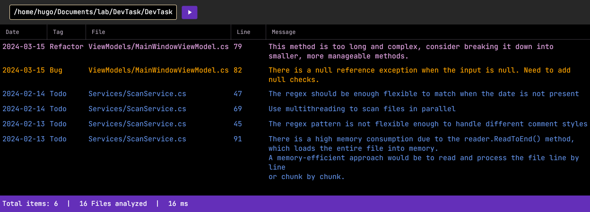

# DevTask
DevTask is a multiplatform project management tool designed to help developers keep track of their tasks within their codebase
It scans your project files for comments tagged with keywords, and presents them in a user-friendly interface.



## Features
- Scans your entire project directory for task comments.
- Displays tasks in a user-friendly interface.
- Sort tasks by tag, file, date, etc.
- Provides a summary of the number of tasks, files scanned, and scan time.
- Only support comments starting with `// keyword` and ending with `// Date` for now.
- [SOON] Supports different comment styles.

## How it Works
DevTask uses regular expressions to scan your project files for comments tagged with
`TODO`, `REFACTOR` or `BUG` (not case sensitive).

For now the date is mandatory and should be in the format DD / MM / YYYY.

These comments should follow the format:

```
// Todo: The task description
// Date: DD / MM / YYYY

// Todo: The task description
// can be multiline
// Date: DD / MM / YYYY

// Refactor: The refactor description
// Date: DD / MM / YYYY

// Bug: The bug description
// Date: DD / MM / YYYY
```

## Installation
### Linux
#### Using installer
Download the latest installer from the [releases page](https://github.com/HugoGaquere/DevTask/releases), then run:
```bash
chmod 755 devtask_linux_x64.sh
sudo ./devtask_linux_x64.sh
```
The application will be installed to `/opt/devtask`.

Run with:
```bash
devtask
```

#### Build from source
1. Install the .NET 8.0 SDK.
2. Run:
```bash
git clone git@github.com:HugoGaquere/DevTask.git
cd DevTask
dotnet publish --configuration Release --runtime linux-x64 --self-contained true DevTask/DevTask.csproj -o ./publish
./publish/DevTask
```

### Windows
Coming soon.
### MacOS
Coming soon.

## Development
This project is developed in C#, targeting .NET 8.0, and follows the Model-View-ViewModel (MVVM) architectural pattern.
It uses the [AvaloniaUI](https://avaloniaui.net/) framework and [ReactiveUI](https://www.reactiveui.net/).

## Roadmap
Here are some future improvements and features we're considering:
- Support for different comment styles
- Make the date optional
- Add dependency injection
- Add tests
- User customization options, such as custom task tags and comment styles
- Generate releases for Windows, and MacOS

Please note that this roadmap may change depending on project needs and contributions.

## Contributing
Contributions are welcome. Please open an issue to discuss your ideas or submit a pull request with your changes.  

## License
This project is licensed under the MIT License.
